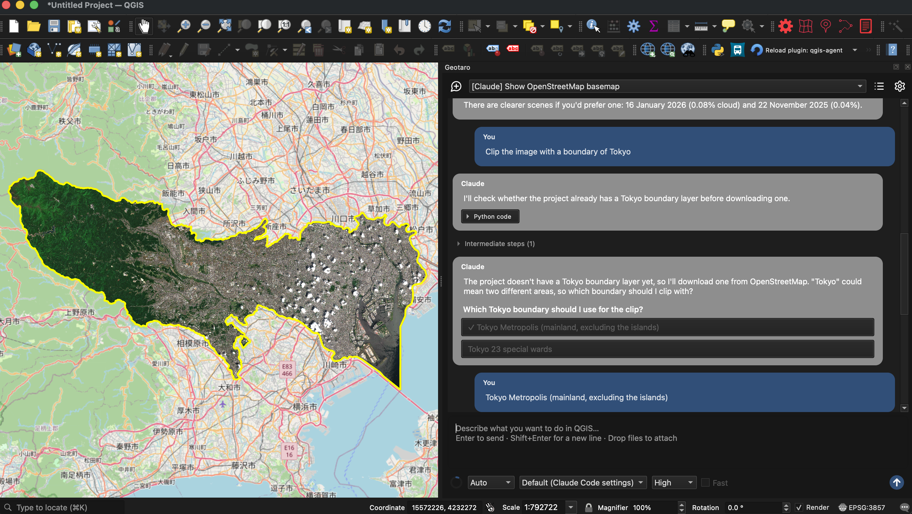

# Geotaro

Geotaro lets you work with your QGIS project through a chat with Claude Code or Codex.

Geotaro running in QGIS. Map data © [OpenStreetMap contributors](https://www.openstreetmap.org/copyright) (ODbL). Contains modified Copernicus Sentinel data 2026.

## Key ideas

- **No MCP setup:** Connect your agent to QGIS directly.
- **Your own agent:** Use your Claude Code or Codex CLI login, or an API key.
- **Python in QGIS:** The agent runs Python with QGIS and Processing tools. This code has the same file and network permissions as QGIS; review it before running it.
- **Processing tools as skills:** The agent discovers the Processing tools available in QGIS and uses them like skills.
- **Reusable workflows:** Save routine operations as Processing scripts.

## Usage

1. Install QGIS 3.44 or later and [Claude Code](https://code.claude.com/docs/en/overview) or the [Codex CLI](https://developers.openai.com/codex/cli).
2. Install and enable the Geotaro plugin, then open it from the Plugins menu or toolbar.
3. Select **New session**, choose Claude or Codex, and log in if prompted.
4. Enter a request such as “Add a point in Sapporo.” In **Ask** mode, approve the generated Python before it runs.

If QGIS cannot find the CLI, set its path in Geotaro's settings. Bundled QGIS skills can be copied to the CLIs with **Settings → General → Sync built-in skills** (overwrites local edits).
